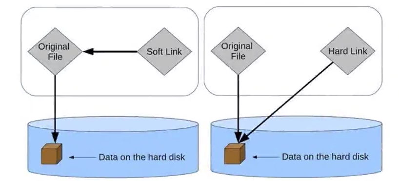

# npm

## 基础

npm（Node Package Manager），安装node时会自动安装

* 基本使用：`npm i xxx`，对于工具包进行全局安装`npm i xxx -g`
* 初始化项目（初始化项目配置文件`package.json`）：`npm init -y` 从零搭建项目或者通过脚手架等项目创建工具创建项目
* 卸载依赖：`npm uninstall package`/`npm uninstall package -D`

## package.json常见字段

* name：项目名称（必须）
* version： 当前项目版本号（必须）
  * semver版本规范：X.Y.Z
    * X主版本号：做了不兼容的API修改
    * Y次版本号：做了向后兼容的新功能新增
    * Z修订号：做了向后兼容的问题修正
  * 版本号之前`^`与`~`的区别
    * `x.y.z`：表示一个明确的版本号
    * `^x.y.z`：表示x是保持不变的，y和z永远安装最新的版本
    * `~x.y.z`：表示x和y是保持不变的，z永远安装最新的版本
* description：项目的基本描述
* author：作者相关信息（发布时用到）
* license：开源协议（发布时用到）
* private：true or false，表示当前项目是否是私有的，当值为true时，npm是不能发布它的（一种防止私有项目误发布的方式）
* main：比如A项目的package.json中`"main: "index.js"`表示当项目A作为某个项目B的依赖添加到其`node_modules`文件夹下，然后我们在消费者项目B中引入项目A时（`import xxx from <name>`/`require(<name>)`），相当于自动引入A项目的`index.js`。
* scripts：scripts属性用于配置一些脚本命令（key:value）
  * `npm run <key>`：即运行key对应的脚本命令
  * key值为start、test、stop、restart可以省略run，如`npm start`
* dependencies：无论开发环境与生产环境的项目依赖
* devDependencies：项目开发依赖，某些包在生产环境是不需要的，如babel、webpack，我们项目开发完打包一次之后其他人用的时候就不需要了。这时候`npm install webpack --save-dev`或者`npm i webpack -D`即可把依赖包添加到devDependencies中。
* peerDependencies：对等依赖，即我们依赖包A，包A必须以包B为前提，如element-plus是依赖于vue3的，element-plus项目的package.json中就会有`"peerDependencies": { "vue": "^3.2.0" }`字段。

## package-lock.json

大致作用：

1. 涉及npm安装缓存算法相关的一些信息，增加效率
2. 记录更加精确的依赖版本信息（package.json中毕竟依赖都是一个范围）

## yarn

**背景**

由Facebook、Google...联合推出的一个js包管理工具，初衷是为了弥补早期npm的一些缺陷，比如安装速度慢、没有缓存、版本依赖混乱...，但是npm5版本开始，npm已经针对缺陷进行了很多改进升级，但是依然有很多人喜欢使用yarn。

**使用**

1. 安装yarn：`npm install yarn -g`（yarn本身也是一个包）
2. 生成package.json：`yarn init -y`
3. 安装依赖：`yarn add xxx`/`yarn add xxx -D`
4. 删除依赖：`yarn remove xxx`

## npx

`npx xxx`：即优先去`node_modules/.bin`目录下寻找可执行命令`xxx`进行执行，如果没有再去环境变量中找。

配置`package.json`中的`scripts`脚本可以进行替代，比如`webpack`命令，我们可以在项目目录下执行`npx webpack`，或者配置`scripts`：

`"build: "npx webpack"`，然后我们执行`npm run build`，`scripts`脚本里的命令默认优先去`node_modules/.bin`文件夹下寻找，所以我们`scripts`脚本中可以省略`npx`直接配置：

~~~
"scripts": {
	"build": "webpack"
}
~~~

## 发包

1. 配置好`package.json`，版本号、协议、作者、项目名、keywords（搜索关键字）...
2. `npm login`登陆npmjs.com账号
3. `npm publish`发布当前项目
4. package.json中更新版本号后重新发布新版本

# pnpm

npm\yarn\cnpm的痛点：电脑中所有项目都要独立的安装项目依赖，导致大量重复安装

pnpm（高性能npm，performant npm）最大的优点就是解决了上述痛点

## 硬链接与软链接的概念

* 硬链接：与原文件一样直接绑定内存（硬盘）数据，对硬链接和文件本身的修改会互相影响，并且他们可以独立存在（删除一个另一个正常）
* 软链接：指向原文件或者原目录的引用。源文件删除，软链接也g

## pnpm工作原理

项目依赖将被存放在磁盘的一个pnpm统一管理的位置，然后所有用到该依赖包的项目都直接建立硬链接（针对文件），用到的所有文件都是磁盘那一份文件的硬链接。

* 如果对同一依赖包使用相同的版本，那么磁盘上只有这个依赖包的一份文件
* 如果对同一依赖包需要使用不同的版本，则仅有版本之间不同的文件会被存储起来
* 所有文件都保存在硬盘上的统一位置
  * 当安装软件包时，其包含的所有文件都会硬链接到此位置，而不会占用额外的硬盘空间
  * 让我们项目之间方便的共享相同版本的依赖包

`npm install pnpm -g`

`pnpm add xxx`